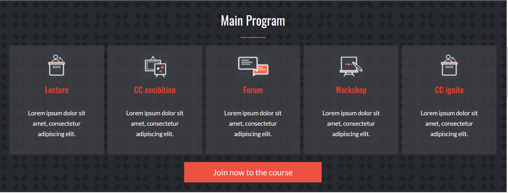
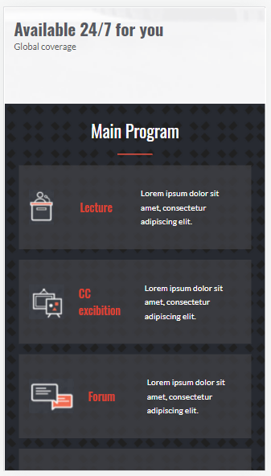
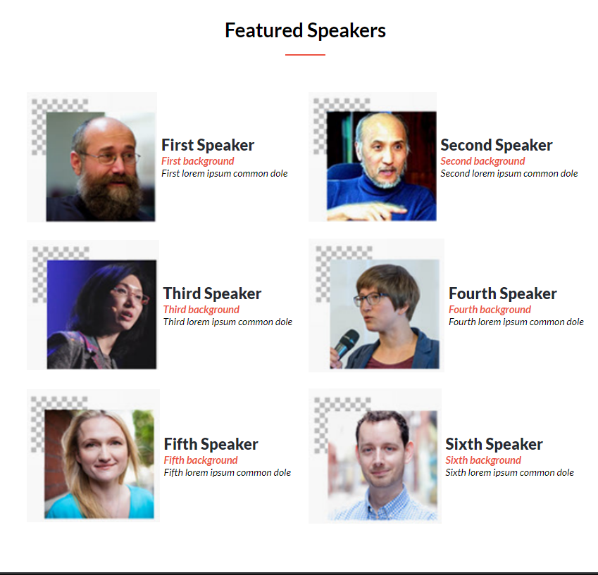

## Preview images

# Electronics didactic course

This is a website composed of two web pages (index.html and about page) that talks about a fictitious electronics course and is made with the aim of showing my developer skills.

## Built With

- HTML
- css
- Javascript

## Live Demo

[Live Demo Link](https://luis-pomare.github.io/firstCapstone/)

## Authors

👤 **Luis pomare**

- GitHub: [@luis-pomare](https://github.com/luis-pomare)
- Twitter: [@LuisPomare1](https://twitter.com/LuisPomare1)
- LinkedIn: [luis-pomare-388116225](https://www.linkedin.com/in/luis-pomare-388116225/)

Give a ⭐️ if you like this project!

## 📝 License

This project is [MIT](./MIT.md) licensed.
